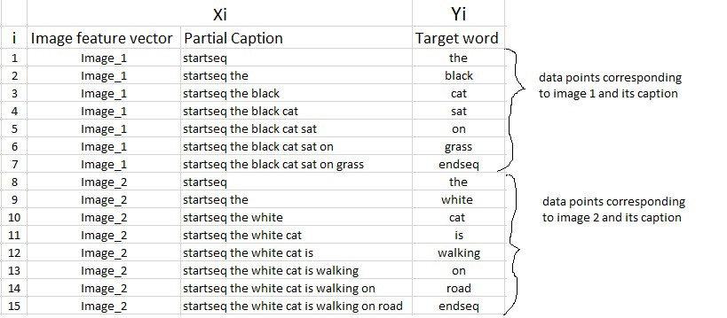
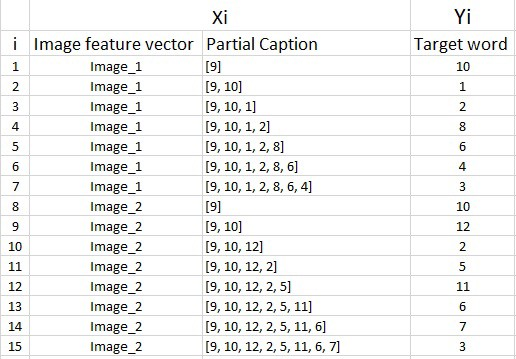
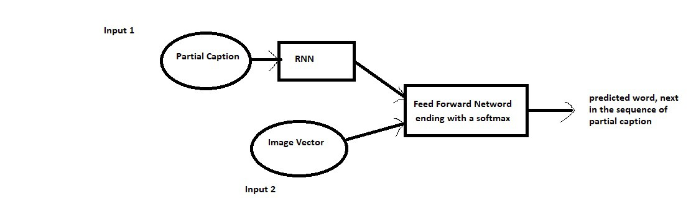

# Image captioning using deep learning

## Credits
* [Blog by Harshall Lamba](https://towardsdatascience.com/image-captioning-with-keras-teaching-computers-to-describe-pictures-c88a46a311b8)

* [Deep learning by Mitesh Khapra](https://www.youtube.com/playlist?list=PLyqSpQzTE6M9gCgajvQbc68Hk_JKGBAYT)


## Prerequisite
* Python
* Keras
* CNN
* RNN
* Text preprocessing

## DataSet
* [Flickr 8K DataSet](https://www.kaggle.com/shadabhussain/flickr8k)

  The dataset contains "Flickr_TextData" directory which contains "Flickr8k.token.txt". This file gives the mapping between image and its captions. For each image there are 5 captions available. For example:- <br /><br />
  Content of Flickr8k.token.txt <br />
  1000268201_693b08cb0e.jpg#0 A child in a ... <br />
  1000268201_693b08cb0e.jpg#1 A girl going... <br />
  1000268201_693b08cb0e.jpg#2 A little girl ... <br />
  1000268201_693b08cb0e.jpg#3 A little girl climbing... <br />
  1000268201_693b08cb0e.jpg#4 A little girl ... <br />
  1001773457_577c3a7d70.jpg#0 A black dog ... <br />
  1001773457_577c3a7d70.jpg#1 A black dog and a ... <br /><br />

  The dataset contains "Images" directory which contains all the images.


## Image Preprocessing
* I have used transfer learning to convert each input image to a fixed vector of size 2048. Transfer learning is used to reduce the training time. For transfer learning I have used ResNet50 trained on imagenet dataset.

  ```
  model = ResNet50(weights="imagenet",input_shape=(224,224,3))

  model_new = Model(model.input,model.layers[-2].output)


  def preprocess_img(img):
    img = image.load_img(img,target_size=(224,224))
    img = image.img_to_array(img)
    img = np.expand_dims(img,axis=0)
    img = preprocess_input(img)
    return img

  def encode_image(img):
    img = preprocess_img(img)
    feature_vector = model_new.predict(img)
    feature_vector = feature_vector.reshape((2048,))
    return feature_vector

  ```
  Above we are using a ResNet50 model which is trained on imagenet dataset. The preprocess_img method is reshaping the input image to a 1 X 224 X 224 X 3 image. Then this image is passed to preprocess_input method which does mean subtraction. It is important because ResNet50 is trained on imagenet dataset which is first mean subtracted. The encode_image method is calling the preprocess_img method and then passing the preprocessed image to ResNet50 to get a 2048 vectorial representaion of the image.


  ```
  img = encode_image("PATH_TO_IMAGE")
  print(img.shape)  # (2048,)

  print(img) # [0.04154301 0.17076042 0.29278612 ... 0.05089623 0.3132239  0.86007506]

  ```

## Caption Preprocessing
* We start by removing words in the caption which contains special characters. We are also removing words whose frequency is less than certain threshold. Then we are giving a unique number to each word present in the vocabulary as shown below.

  ```
  word_to_idx = {}
  idx_to_word = {}

  for i,word in enumerate(total_words):
    word_to_idx[word] = i+1
    idx_to_word[i+1] = word

  ```

  we can summarize the data matrix for one image and its corresponding caption as follows:-

   <br />
  As you can observe, multiple training points can be generated from a single image with its single caption by breaking the caption word by word.

  Similarly if we consider both the images and their captions, our data matrix will then look as follows:- <br />
   <br />

  Since we have already created an index for each word, let’s now replace the words with their indices and understand how the data matrix will look like: <br />
   <br />


## Training
   <br />
  Caption processing pipeline:-
  ``` 
  input_captions = Input(shape=(max_len,))
  inp_cap1 = Embedding(input_dim=vocab_size,output_dim=50,mask_zero=True)(input_captions)
  inp_cap2 = Dropout(0.3)(inp_cap1)
  inp_cap3 = LSTM(256)(inp_cap2)
  ```

  Image processing pipeline:-
  ```
  input_img_features = Input(shape=(2048,))
  inp_img1 = Dropout(0.3)(input_img_features)
  inp_img2 = Dense(256,activation='relu')(inp_img1)
  ```

  Final model:-
  ```
  decoder1 = add([inp_img2,inp_cap3])
  decoder2 = Dense(256,activation='relu')(decoder1)
  outputs = Dense(vocab_size,activation='softmax')(decoder2)
  model = Model(inputs=[input_img_features,input_captions],outputs=outputs)
  ```
